# Clinsync: Gap Analysis, ER Diagram, and Product Review

**Status:** Analysis against the Tebra + IntakeQ feature blueprint you provided, 2026-09-23.
**Method:** Every claim below was checked against the actual code in this repo, not assumed.

---

## 1. Gap analysis — what's missing, against your blueprint

Legend: ✅ built and working · ⚠️ partially built (the data model exists but the real
behavior doesn't, or vice versa) · ❌ not present at all.

### Patient Intake & Onboarding
| Feature | Status | Reality in the codebase |
|---|---|---|
| Digital intake forms | ✅ | `formTemplates`/`formSubmissions` + the `/intake/[token]` flow. Real, working, mobile-responsive. |
| e-Signatures | ❌ | `commConsentSigned` is a plain boolean a *staff member* can tick when adding a patient — it is not a patient-executed, legally-binding signature capture. No signature UI or signature-image/hash storage exists anywhere. |
| Automated IntakeQ→chart sync | ⚠️ | This is exactly what `src/lib/ehr-sync.ts` and the dual-sourced patient columns do — but only against the *mock* IntakeQ/Tebra connectors (`src/connectors/*.mock.ts`). No real API integration exists yet (no credentials — see `EhrConnectionsForm`). |
| Custom questionnaires with auto-scoring | ⚠️ | `patients.ratingScales` stores `{name, score, date}` (e.g. "PHQ-9: 18") and form templates support arbitrary questions — but nothing in the code *computes* a score from individual question answers. Scores are entered as already-known numbers, not derived. `src/lib/auto-classify.ts` exists but doesn't do scale scoring. |

### Clinical Charting & Care
| Feature | Status | Reality |
|---|---|---|
| AI-powered charting / SOAP notes / macros | ❌ | Free-text `notes` on appointments and a handful of staff note fields (`formNotes`, `reviewerNotes`, `piRecommendation`) — no note templates, no AI assistance, no macros. |
| e-Prescribing | ❌ | Not built, and flagged as **out of scope** in `docs/ehr-platform-architecture.md` — this needs real DEA EPCS certification and pharmacy network connectivity, not just code. |
| CPOE (lab/imaging orders) | ❌ | No orders table, no lab-results table, no imaging integration of any kind. |
| Telehealth | ❌ | No video integration. `appointments.visitReason` is free text; nothing models a video link, session, or telehealth-specific consent. |

### Practice Management & Scheduling
| Feature | Status | Reality |
|---|---|---|
| Public online booking widget | ❌ | `/calendar` is staff-only, for staff to book patients. There is no patient- or public-facing self-scheduling page. |
| Automated appointment reminders | ⚠️ | `broadcasts` can send SMS/email (simulated delivery) — but it's a manually-triggered bulk tool, not a scheduled system that automatically fires N hours before each appointment. |
| Reputation management (review requests) | ⚠️ | `reviews`/Experience Surveys ask the patient to rate the *practice internally* — there's no integration that pushes a happy patient to leave a public Google/Yelp review, which is the actual PatientPop-style feature. |

### Billing & Revenue Cycle
| Feature | Status | Reality |
|---|---|---|
| Real-time insurance eligibility check | ❌ | Not present. `insuranceClaims` models a claim's lifecycle *after* a visit, not a pre-visit eligibility/copay lookup. |
| Digital invoicing & patient payments | ✅ | `patientStatements` + `mockPayments` + a working (simulated) card-payment form. |
| Electronic claim submission | ⚠️ | The full claim *data model and status lifecycle* exists (rejected/denied/waiting-adjudication/needs-investigation/paid) — but nothing actually transmits a claim to a clearinghouse. That requires a real clearinghouse contract (Availity, Change Healthcare, etc.), a business step, not an engineering one. |

### Secure Patient Portal Dashboard
| Feature | Status | Reality |
|---|---|---|
| Two-way secure messaging | ✅ | Real, working, both directions, with read receipts. |
| Records access (meds, diagnoses, visit history) | ✅ | Medications, diagnoses, allergies, appointments all visible in the patient portal. |
| Records access (care plans, lab results) | ❌ | Neither "care plan" nor "lab result" is a modeled entity anywhere in the schema. |

### Verdict on the feature blueprint
**Roughly built:** intake forms, dual-source reconciliation architecture, billing data model,
patient messaging/records access, experience surveys.
**Structurally missing (need new tables + UI, no legal/regulatory blocker):** e-signatures,
questionnaire auto-scoring, automated reminders-by-schedule, public booking widget, care
plans, lab results.
**Out of reach without a real business/regulatory step, regardless of engineering effort:**
e-prescribing, CPOE with real lab connectivity, real insurance eligibility checks, real claim
submission, real IntakeQ/Tebra API sync (needs the vendor to issue credentials).

---

## 2. HIPAA / legal gap check

### Patient-facing Terms & Conditions
| Required clause | Status |
|---|---|
| No-emergency-use disclaimer | ❌ Not present anywhere in the patient portal. |
| "Not medical advice" disclaimer | ❌ Not present. |
| Account security responsibility clause | ❌ Not present. |
| Communication turnaround-time expectation | ❌ Not present (Messages has no SLA copy). |
| Proxy/guardian access rules for minors | ❌ Not present, and not architecturally possible today — the patient portal auth model is strictly one patient = one account; there is no concept of a linked guardian/dependent account at all. |
| Termination-of-access clause | ⚠️ The *mechanism* exists (`revokePatientPortalAccess()`, an admin action) — but it's never presented to the patient as a term they agreed to. |

### Required compliance documents
| Document | Status |
|---|---|
| Notice of Privacy Practices (NPP) | ❌ No such document or acknowledgment flow exists. |
| Informed consent for telehealth | ❌ Moot until telehealth itself exists, but flagging since it was in your list. |

**None of the above exist as UI today, and none should be invented by an engineer.** These
are legal documents — they need to be drafted or reviewed by the practice's healthcare
attorney/compliance officer. What I *can* build once you have the text: a mandatory
checkbox-gated acceptance flow at first patient-portal login, versioned so you can prove
which policy text a given patient agreed to and when.

### Technical safeguards
| Safeguard | Status | Reality |
|---|---|---|
| TLS in transit | ✅ | Handled by Vercel's hosting (HTTPS by default). |
| Encryption at rest | ⚠️ | Neon Postgres encrypts the database at rest at the infrastructure level (standard, HIPAA-acceptable). Additionally, ID numbers get application-level AES-256-GCM encryption (`src/lib/crypto.ts`). Most other PHI columns (names, diagnoses, medications) rely on infrastructure-level encryption only, which is common practice but worth knowing explicitly. |
| Role-Based Access Control | ✅/⚠️ | Real RBAC exists (admin/PI/CRC), fixed and enforced this session. Not full "minimum necessary," though — Admin and CRC currently see every patient in the practice; only the PI role is scoped to "My Patients." |
| Audit logging | ✅ | Extensive — `auditLog` table plus `logAudit()`/`logPatientPortalAction()` calls on essentially every read and write path, staff and patient side both. |
| Automatic logoff | ⚠️ | **Staff sessions**: yes — 10 min idle warning, 12 min forced logout (`SessionTimeoutWarning`). **Patient portal sessions**: no equivalent exists — a patient portal session has a 1-hour max-age cookie but no idle-timeout warning/kick. |
| Multi-Factor Authentication | ❌ | Confirmed absent — and the code already says so itself, in a comment on `patient-session.ts`: *"a patient portal session on a shared/public device is a real risk this pilot hasn't otherwise mitigated (no 'remember this device', no MFA)."* |
| BAAs (Tebra, IntakeQ, cloud host) | N/A to code | A legal/business action for the practice to complete, not something to build. Flagged here only because it's a prerequisite for the real (non-mock) integrations. |

---

## 3. Full Entity-Relationship diagram

Every table currently in `src/db/schema.ts`, with real foreign keys (26 tables, all
FK-verified against the actual delete-cascade logic in `deletePatient()`).

```mermaid
erDiagram
    PATIENTS ||--o{ DIAGNOSES : has
    PATIENTS ||--o{ MEDICATION_EPISODES : has
    PATIENTS ||--o{ PATIENT_TRIAL_SCREENINGS : "screened for"
    PATIENT_TRIAL_SCREENINGS }o--|| TRIALS : "against"
    PATIENT_TRIAL_SCREENINGS ||--o{ SCREENING_CRITERIA_RESULTS : produces
    PATIENTS ||--o{ FORM_SUBMISSIONS : "sent"
    FORM_SUBMISSIONS }o--|| FORM_TEMPLATES : "of"
    PATIENTS ||--o{ FORM_CHART_DISCREPANCIES : flags
    FORM_SUBMISSIONS ||--o{ FORM_CHART_DISCREPANCIES : "checked against"
    PATIENTS ||--o{ ALLERGIES : has
    PATIENTS ||--o| IDENTITY_VERIFICATIONS : has
    PATIENTS ||--o{ APPOINTMENTS : books
    PROVIDERS ||--o{ APPOINTMENTS : staffs
    PATIENTS ||--o{ MESSAGES : sends_receives
    PATIENTS ||--o{ REVIEWS : "asked for"
    FORM_SUBMISSIONS ||--o{ REVIEWS : "triggered by"
    PATIENTS ||--o{ CHARGES : billed
    CHARGES ||--o{ INSURANCE_CLAIMS : "claimed via"
    PATIENTS ||--o{ INSURANCE_CLAIMS : "claimed for"
    PATIENTS ||--o{ PATIENT_STATEMENTS : "statemented"
    PATIENTS ||--o{ MOCK_PAYMENTS : pays
    CHARGES ||--o{ MOCK_PAYMENTS : "paid against"
    PATIENTS ||--o{ DOCUMENTS : "filed under"
    PATIENTS ||--o{ FAXES : "filed under"
    TRIALS ||--o{ BROADCASTS : "optionally filters"
    USERS ||--o{ AUDIT_LOG : "acts (by name, not FK)"

    PATIENTS {
        text id PK "RD-0001 style anon id"
        text intakeqClientIdRef "ENC[...] pseudonymous ref, NOT NULL"
        text tebraPatientIdRef "ENC[...] pseudonymous ref, nullable"
        text nameIntakeq "NOT NULL - dual-sourced"
        text nameTebra
        date dobIntakeq "NOT NULL - dual-sourced"
        date dobTebra
        text currentProvider
        jsonb ratingScales
        text portalPasswordHash "null = no portal access"
        timestamp chartDataAsOf
    }
    DIAGNOSES {
        serial id PK
        text patientId FK
        text code
        text description
        text source "tebra | intakeq"
    }
    MEDICATION_EPISODES {
        serial id PK
        text patientId FK
        text name
        text medicationClass
        text status "active | inactive"
    }
    TRIALS {
        text id PK "e.g. nct06911112"
        text name
        text condition
        integer ageMin
        integer ageMax
    }
    PATIENT_TRIAL_SCREENINGS {
        serial id PK
        text patientId FK
        text trialId FK
        enum overallStatus "green | yellow | red"
    }
    SCREENING_CRITERIA_RESULTS {
        serial id PK
        integer screeningId FK
        text criterionKey
        enum criterionType "inclusion | exclusion"
        enum verdict
    }
    IDENTITY_MATCHES {
        serial id PK
        text intakeqClientIdRef "not FK - a candidate pairing"
        text referralName
        text candidateTebraPatientIdRef "not FK"
        text candidateName
        integer confidence "0-100"
        enum status "pending | confirmed | rejected"
    }
    USERS {
        serial id PK
        text name
        text email
        enum role "admin | pi | crc"
        text passwordHash
    }
    FORM_TEMPLATES {
        serial id PK
        text name
        text diagnosisTag
    }
    FORM_SUBMISSIONS {
        serial id PK
        integer templateId FK
        text patientId FK
        enum status "sent | partial | completed"
        jsonb answers
        text accessToken "unguessable, unauthenticated intake link"
    }
    FORM_CHART_DISCREPANCIES {
        serial id PK
        text patientId FK
        integer formSubmissionId FK
        text patientAnswer
        text chartFinding
        boolean resolved
    }
    ALLERGIES {
        serial id PK
        text patientId FK
        text allergen
        enum severity
    }
    IDENTITY_VERIFICATIONS {
        serial id PK
        text patientId FK "unique - one per patient"
        enum idType
        text idNumberEncrypted "AES-256-GCM"
        boolean verified
    }
    PROVIDERS {
        serial id PK
        text name
        text specialty
        boolean isActive
    }
    APPOINTMENTS {
        serial id PK
        text patientId FK
        integer providerId FK
        timestamp startsAt
        timestamp endsAt
        enum status "scheduled | completed | cancelled | no_show"
    }
    MESSAGES {
        serial id PK
        text patientId FK
        text senderRole "provider | patient"
        text body
        timestamp readByPatientAt
        timestamp readByProviderAt
    }
    REVIEWS {
        serial id PK
        text patientId FK
        integer formSubmissionId FK
        enum status "sent | completed"
        integer ratingOverall "1-5"
    }
    CHARGES {
        serial id PK
        text patientId FK
        text providerName
        jsonb diagnosisCodes
        jsonb procedureCodes
        enum status "draft | pending_approval | approved | submitted"
    }
    INSURANCE_CLAIMS {
        serial id PK
        integer chargeId FK
        text patientId FK
        enum status "rejected | denied | waiting_adjudication | needs_investigation | paid"
    }
    PATIENT_STATEMENTS {
        serial id PK
        text patientId FK
        enum type "initial | reminder | final_notice"
        enum deliveryStatus "delivered | failed"
    }
    MOCK_PAYMENTS {
        serial id PK
        text patientId FK
        integer chargeId FK "nullable"
        text cardLast4 "last 4 only, never a full PAN"
        enum result
    }
    DOCUMENTS {
        serial id PK
        text patientId FK "nullable"
        enum status "new | processed"
        enum label
    }
    FAXES {
        serial id PK
        text patientId FK "nullable"
        enum deliveryStatus
    }
    BROADCASTS {
        serial id PK
        text filterTrialId FK "nullable"
        jsonb recipients "snapshot, not a live FK join"
        enum channel "sms | email | both"
    }
    AUDIT_LOG {
        serial id PK
        text userName "by name, not a FK to users"
        enum role
        text action
        text patientId "nullable, not FK - historical log"
    }
    APP_SETTINGS {
        serial id PK "singleton row"
        boolean autoClassifyOnComplete
        text intakeqApiKeyEncrypted "placeholder for real creds"
        text tebraCustomerKeyEncrypted
    }
```

**Notable design choices visible in the diagram:**
- `patients.id` (the `RD-####` anonymous id) is the join key almost everywhere, not a
  numeric surrogate — deliberate, since it's also the patient-facing identifier.
- No foreign key cascades on delete anywhere (confirmed by `deletePatient()`'s own explicit
  17-table cleanup) — every "remove a patient" operation must clear children before parents.
- `identityMatches`, `auditLog`, and `broadcasts.recipients` intentionally hold
  *non-FK, string-based* references — they're historical/candidate records that must survive
  even if the patient they refer to is later deleted or never confirmed.

---

## 4. Product review

**What Clinsync actually is today:** a clinical-trial pre-screening and reconciliation
workbook for a specific pilot (IPMG), with a genuinely well-built RBAC/audit/billing/
patient-portal foundation underneath it — not, and not yet positioned to be, a full EHR.

**Where it's strong:**
- The dual-source reconciliation model (IntakeQ vs. Tebra, with a visible "Merged (used)"
  precedence) is the actual hard problem a pre-screening tool needs to solve, and it's real,
  not decorative.
- RBAC, audit logging, and session handling are more rigorous than most prototypes reach —
  this reads like software that was built to eventually pass a security review, not just to
  demo.
- The billing data model (charges → claims → statements → payments) is complete enough that
  a real RCM workflow could be built on top of it without a schema rewrite.
- Everything that's mocked (Tebra, IntakeQ, payments, SMS/email delivery) is mocked
  *honestly* — deterministic, clearly-labeled simulation, never a fake success dressed up as
  a real one. That matters for trusting the demo.

**Where it's genuinely thin, relative to "a full EHR":**
- Zero clinical documentation depth — no SOAP notes, no care plans, no lab results, no
  orders. This is the biggest gap between what exists and what the blueprint describes.
- Zero compliance-facing legal surface — no NPP, no ToS acceptance, no signature capture.
  For a real pilot handling real PHI, this is the single highest-priority gap, and it's a
  legal drafting task before it's an engineering one.
- No MFA and no patient-side auto-logoff — both cheap to add, both currently missing.
- Every "integration" (Tebra, IntakeQ) is a mock. The reconciliation *logic* is real and
  ready; the moment real API credentials exist, `src/lib/ehr-sync.ts` is the seam to plug
  them into — but until then, nothing here talks to a real external system.

**Honest bottom line:** as a pre-screening and identity-reconciliation tool for this specific
pilot, this is in good shape and close to genuinely pilot-ready pending the legal/compliance
documents. As "a Tebra + IntakeQ replacement," it's roughly the scheduling/charting/billing
*data model* of one, with the clinical depth, compliance surface, and real integrations still
to build — which is exactly what `docs/ehr-platform-architecture.md`'s phased roadmap
already scopes out.
